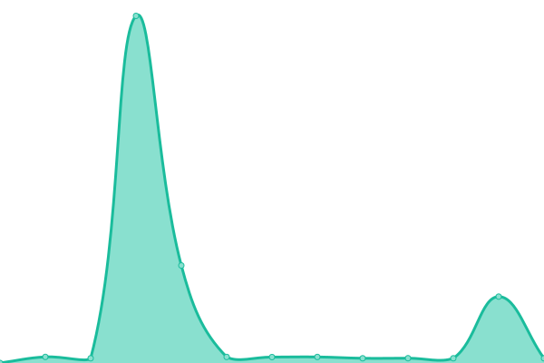
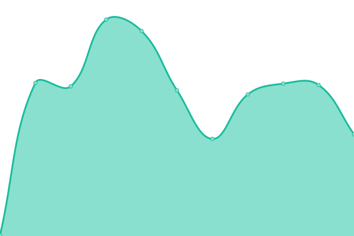
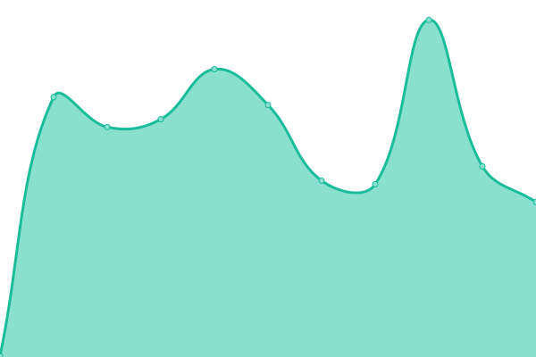
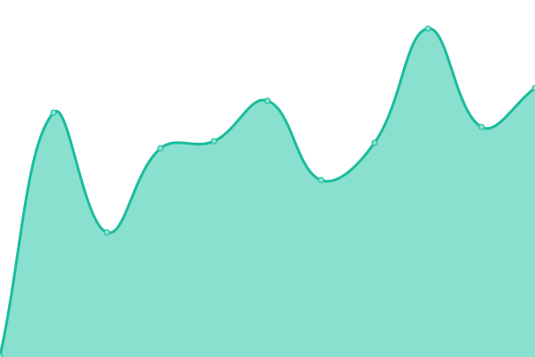
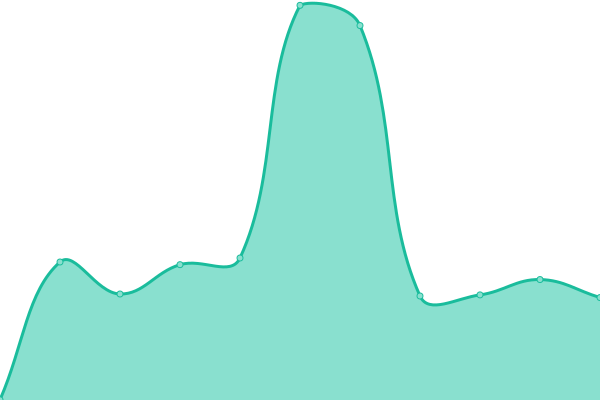
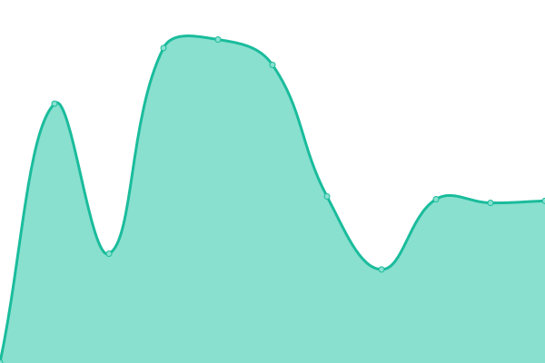
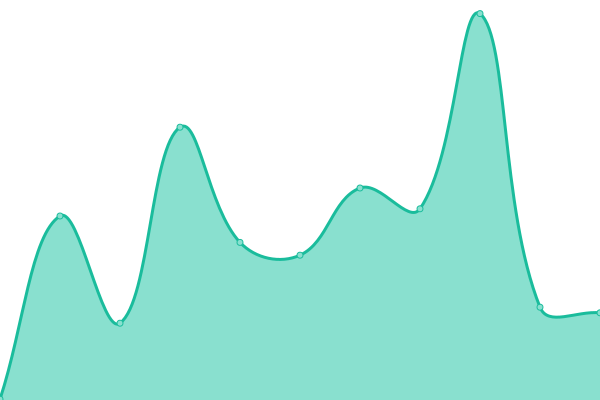

# [📈 Live Status](https://marcosdid-kompa.github.io/upptime-kompa): <!--live status--> **Todos os sistemas estão funcionando**

This repository contains the open-source uptime monitor and status page for [marcosdid-kompa](https://marcosdid-kompa.github.io/upptime-kompa), powered by [Upptime](https://github.com/upptime/upptime).

With [Upptime](https://upptime.js.org), you can get your own unlimited and free uptime monitor and status page, powered entirely by a GitHub repository. We use [Issues](https://github.com/marcosdid-kompa/upptime-kompa/issues) as incident reports, [Actions](https://github.com/marcosdid-kompa/upptime-kompa/actions) as uptime monitors, and [Pages](https://marcosdid-kompa.github.io/upptime-kompa) for the status page.

<!--start: status pages-->
<!-- This summary is generated by Upptime (https://github.com/upptime/upptime) -->
<!-- Do not edit this manually, your changes will be overwritten -->
<!-- prettier-ignore -->
| URL | Status | History | Response Time | Uptime |
| --- | ------ | ------- | ------------- | ------ |
|  [App Kompa (PAGE)](https://app.kompa.com.br/) | Acima | [app-kompa-page.yml](https://github.com/marcosdid-kompa/upptime-kompa/commits/HEAD/history/app-kompa-page.yml) | 

 721ms
     
 | 

<a href="https://marcosdid-kompa.github.io/upptime-kompa/history/app-kompa-page">100.00%</a>
    

|  [App Kompa (API)](https://app.kompa.com.br/pagamentos/check-user/) | Acima | [app-kompa-api.yml](https://github.com/marcosdid-kompa/upptime-kompa/commits/HEAD/history/app-kompa-api.yml) | 

 1282ms
     
 | 

<a href="https://marcosdid-kompa.github.io/upptime-kompa/history/app-kompa-api">100.00%</a>
    

|  [App Kompa Homologação (PAGE)](https://hg.kompa.com.br/) | Acima | [app-kompa-homologacao-page.yml](https://github.com/marcosdid-kompa/upptime-kompa/commits/HEAD/history/app-kompa-homologacao-page.yml) | 

 292ms
     
 | 

<a href="https://marcosdid-kompa.github.io/upptime-kompa/history/app-kompa-homologacao-page">100.00%</a>
    

|  [Portal](https://portal.kompa.com.br/) | Acima | [portal.yml](https://github.com/marcosdid-kompa/upptime-kompa/commits/HEAD/history/portal.yml) | 

 441ms
     
 | 

<a href="https://marcosdid-kompa.github.io/upptime-kompa/history/portal">100.00%</a>
    

|  [Broker](https://broker.assinasaude.com.br/) | Acima | [broker.yml](https://github.com/marcosdid-kompa/upptime-kompa/commits/HEAD/history/broker.yml) | 

 229ms
     
 | 

<a href="https://marcosdid-kompa.github.io/upptime-kompa/history/broker">100.00%</a>
    

|  [Karmen (PAGE)](https://karmen.kompa.com.br/login) | Acima | [karmen-page.yml](https://github.com/marcosdid-kompa/upptime-kompa/commits/HEAD/history/karmen-page.yml) | 

 261ms
     
 | 

<a href="https://marcosdid-kompa.github.io/upptime-kompa/history/karmen-page">100.00%</a>
    

|  [Karmen Rasa (API)](https://karmen.kompa.com.br/health) | Acima | [karmen-rasa-api.yml](https://github.com/marcosdid-kompa/upptime-kompa/commits/HEAD/history/karmen-rasa-api.yml) | 

 139ms
     
 | 

<a href="https://marcosdid-kompa.github.io/upptime-kompa/history/karmen-rasa-api">100.00%</a>
    

|  [Vindi](app.vindi.com.br) | Acima | [vindi.yml](https://github.com/marcosdid-kompa/upptime-kompa/commits/HEAD/history/vindi.yml) | 

 311ms
     
 | 

<a href="https://marcosdid-kompa.github.io/upptime-kompa/history/vindi">100.00%</a>
    

|  [Versatilis](http://sistema.globalmedclinica.com.br/globalmed/login3.aspx) | Acima | [versatilis.yml](https://github.com/marcosdid-kompa/upptime-kompa/commits/HEAD/history/versatilis.yml) | 

 684ms
     
 | 

<a href="https://marcosdid-kompa.github.io/upptime-kompa/history/versatilis">100.00%</a>
    

|  [Google](https://www.google.com/) | Acima | [google.yml](https://github.com/marcosdid-kompa/upptime-kompa/commits/HEAD/history/google.yml) | 

 115ms
     
 | 

<a href="https://marcosdid-kompa.github.io/upptime-kompa/history/google">100.00%</a>
    

|  [Octadesk](https://octadesk.com) | Acima | [octadesk.yml](https://github.com/marcosdid-kompa/upptime-kompa/commits/HEAD/history/octadesk.yml) | 

 471ms
     
 | 

<a href="https://marcosdid-kompa.github.io/upptime-kompa/history/octadesk">100.00%</a>
    

|  [LiveChat](https://www.livechat.com/pt/) | Acima | [live-chat.yml](https://github.com/marcosdid-kompa/upptime-kompa/commits/HEAD/history/live-chat.yml) | 

 645ms
     
 | 

<a href="https://marcosdid-kompa.github.io/upptime-kompa/history/live-chat">100.00%</a>
    

|  [Twilio](https://www.twilio.com/) | Acima | [twilio.yml](https://github.com/marcosdid-kompa/upptime-kompa/commits/HEAD/history/twilio.yml) | 

 689ms
     
 | 

<a href="https://marcosdid-kompa.github.io/upptime-kompa/history/twilio">100.00%</a>
    

|  [Whereby](https://whereby.com/) | Acima | [whereby.yml](https://github.com/marcosdid-kompa/upptime-kompa/commits/HEAD/history/whereby.yml) | 

 690ms
     
 | 

<a href="https://marcosdid-kompa.github.io/upptime-kompa/history/whereby">100.00%</a>
    

|  [Sendgrid](https://sendgrid.com/) | Acima | [sendgrid.yml](https://github.com/marcosdid-kompa/upptime-kompa/commits/HEAD/history/sendgrid.yml) | 

 202ms
     
 | 

<a href="https://marcosdid-kompa.github.io/upptime-kompa/history/sendgrid">100.00%</a>
    

<!--end: status pages-->

[**Visit our status website →**](https://marcosdid-kompa.github.io/upptime-kompa)

## 📄 License

- Powered by: [Upptime](https://github.com/upptime/upptime)
- Code: [MIT](./LICENSE) © [marcosdid-kompa](https://marcosdid-kompa.github.io/upptime-kompa)
- Data in the `./history` directory: [Open Database License](https://opendatacommons.org/licenses/odbl/1-0/)
